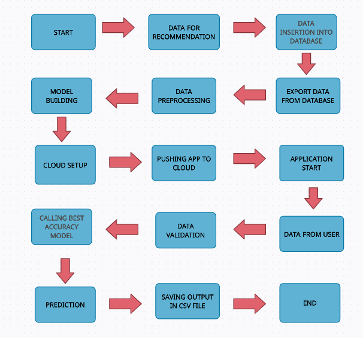

# Credit Card Defaulters Prediction

## Description:
The repository represents "Credit Card Defaulters Prediction".
With the help of this project, we can able to predict the probability of credit default based on credit card owner's characteristics and payment history.
This Project is implemented using the Machine Learning Algorithm XGBoost.

## Dataset:
Download the dataset for custom training.
https://www.kaggle.com/uciml/default-of-credit-card-clients-dataset

## Project Architecture:

## Setup:
Install the packages mentioned in requirements.txt.
Run the training.py file for training.
Run the app.py file for running the Flask app in your local system.

